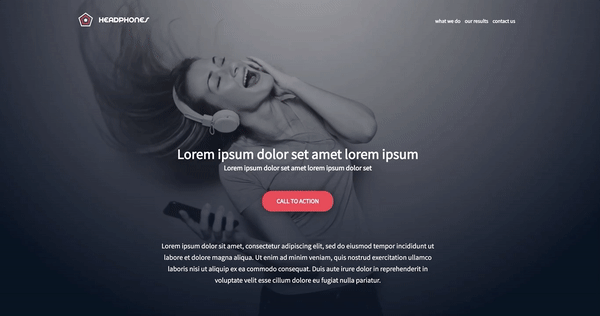

ALX Implement a design from scratch Project

This projects is about creating a Holberton School website called Headphone Company. The students are expected to leaverage the potential of CSS and HTML to demostrate responsiveness by implimenting a prototype below created with FIGMA Prototyping tool

PASTE this link into your browser to access prototype
https://www.figma.com/file/TwFqqWGYvNYvxZxhdWXv4H/Holberton-School---Headphone-company?type=design&node-id=0-1&mode=design&t=PsuxRlLqHBDP0Rjc-0

Tasks

0. Read and be familiar with Figma
1. Header: create the header/hero piece

Desktop version

Mobile version

2. "What we do..." section
3. "Our results" section
4. Contact us
5. Footer

Desktop version

Mobile version

6. Replace background image with... code!
7. Let's animate items